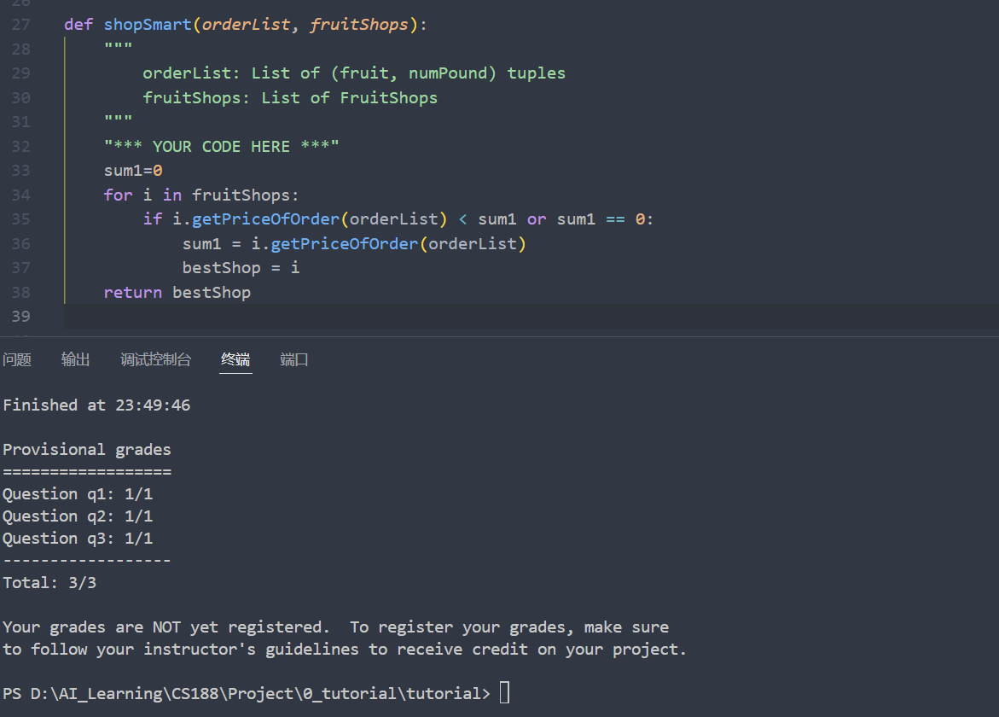

## Before Start
我学习的CS188课程是基于 UC Berkeley的CS 188 Spring 2025
[课程官网](https://inst.eecs.berkeley.edu/~cs188/sp25/#cs-188-spring-2025)

## Project0
配置python环境:
我按照课程网站中的说明搭建环境 [课程网站搭建环境说明](https://inst.eecs.berkeley.edu/~cs188/sp25/projects/proj0/#setting-up-a-conda-environment-recommended)
使用miniconda搭建了一个名为cs188的环境,python版本为3.11,并安装numpy和matplotlib
python基础：
修改 addition.py, buyLotsOfFruit.py, shopSmart.py三个文件，使其完成对应的功能，成功通过测试。
唯一需要注意的点是在写shopSmart.py的时候要仔细阅读shop.py文件。
通过测试：

## Project1

## Project2

