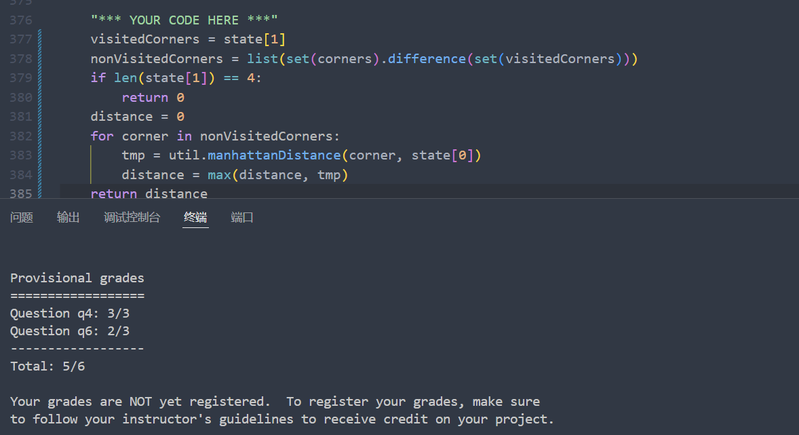

## Project0
配置python环境:<br>
我按照课程网站中的说明搭建环境 [课程网站搭建环境说明](https://inst.eecs.berkeley.edu/~cs188/sp25/projects/proj0/#setting-up-a-conda-environment-recommended)<br>
使用miniconda搭建了一个名为cs188的环境,python版本为3.11,并安装numpy和matplotlib<br>
python基础：<br>
修改 addition.py, buyLotsOfFruit.py, shopSmart.py三个文件，使其完成对应的功能，成功通过测试。<br>
唯一需要注意的点是在写shopSmart.py的时候要仔细阅读shop.py文件。<br>
通过测试：<br>
<br>

## Project1:Search
Project1要求实现单智能体搜索的几种算法<br>

### Q1
DFS实现
```python
def depthFirstSearch(problem: SearchProblem):
    path=[]
    visited=[]
    stack=util.Stack()
    stack.push((problem.getStartState(),[]))
    while not stack.isEmpty():
        state, path = stack.pop()
        if problem.isGoalState(state):
            return path
        if state not in visited:
            visited.append(state)
            for successor, action, stepCost in problem.getSuccessors(state):
                new_path = path + [action]
                stack.push((successor, new_path))
    return path  # If no solution is found, return an empty list  
    util.raiseNotDefined()
```

### Q2
BFS实现<br>
只需要将DFS实现中的stack换成queue就行了<br>
```pyhton
def breadthFirstSearch(problem: SearchProblem):
    """Search the shallowest nodes in the search tree first."""
    "*** YOUR CODE HERE ***"
    path=[]
    visited=[]
    queue=util.Queue()
    queue.push((problem.getStartState(),[]))
    while not queue.isEmpty():
        state, path = queue.pop()
        if problem.isGoalState(state):
            return path
        if state not in visited:
            visited.append(state)
            for successor, action, stepCost in problem.getSuccessors(state):
                new_path = path + [action]
                queue.push((successor, new_path))
    return path  # If no solution is found, return an empty list  
    util.raiseNotDefined()
```

### Q3
UCS Search 实现(Uniform Cost Search)<br>
使用Priority Queue,这里用的是最小堆<br>
>UCS介绍：一致代价搜索（Uniform Cost Search，UCS）是一种用于在图中找到最低成本路径的搜索算法，它是迪杰斯特拉算法的一种变体。在UCS中，我们不是将所有顶点都放入优先队列，而是仅插入源顶点，然后逐个插入需要的顶点。在每一步中，我们检查项是否已经在优先队列中（使用访问数组）。如果是，我们执行降低键值操作，否则我们插入它。

```python
def uniformCostSearch(problem: SearchProblem):
    """Search the node of least total cost first."""
    "*** YOUR CODE HERE ***"
    visited = []

    heap = util.PriorityQueue()
    start = (problem.getStartState(), [], 0)
    heap.push(start, 0)

    while not heap.isEmpty():
        (state, path, cost) = heap.pop()
        if problem.isGoalState(state):
            return path #找到GoalState,返回路径

        if state not in visited:
            visited.append(state)
            for currState, currPath, currCost in problem.getSuccessors(state):
                newPath = path + [currPath]
                newCost = cost + currCost
                newState = (currState, newPath, newCost)
                heap.push(newState, newCost) #找到与当前state相连的所有状态,将其加入堆中

    return path
    util.raiseNotDefined()
```

### Q4
实现A* search<br>
A* search在代码的实现上其实和上面的UCS基本一致<br>
但是A*的放入堆的优先级的值=累计代价+启发函数的值<br>
```python
def aStarSearch(problem: SearchProblem, heuristic=nullHeuristic):
    """Search the node that has the lowest combined cost and heuristic first."""
    "*** YOUR CODE HERE ***"
    visited = []

    heap = util.PriorityQueue()
    start = (problem.getStartState(), [], 0)
    heap.push(start, 0)

    while not heap.isEmpty():
        (state, path, cost) = heap.pop()
        if problem.isGoalState(state):
            return path #找到GoalState,返回路径

        if state not in visited:
            visited.append(state)
            for currState, currPath, currCost in problem.getSuccessors(state):
                newPath = path + [currPath]
                newCost = cost + currCost
                newState = (currState, newPath, newCost)
                heap.push(newState, newCost+ heuristic(currState, problem)) #将当前状态的cost与heuristic值相加,作为优先级

    return path
    util.raiseNotDefined()
```

### Q5
**Finding All the Corners**<br>
设计一个Agent,要求在这个Agent的策略下，Pacman会经过所有的四个corner<br>
需要补充完成的代码如下：<br>

```python
    def getStartState(self):
        """
        Returns the start state (in your state space, not the full Pacman state
        space)
        """
        "*** YOUR CODE HERE ***"
        return (self.startingPosition,[]) # 初始状态:一个位置和一个已访问的角落的列表
        util.raiseNotDefined()

    def isGoalState(self, state: Any):
        """
        Returns whether this search state is a goal state of the problem.
        """
        "*** YOUR CODE HERE ***"
        isGoal = len(state[1]) == 4  # 检查已访问的角落数量是否为4
        return isGoal
        util.raiseNotDefined()

    def getSuccessors(self, state: Any):
        """
        Returns successor states, the actions they require, and a cost of 1.

         As noted in search.py:
            For a given state, this should return a list of triples, (successor,
            action, stepCost), where 'successor' is a successor to the current
            state, 'action' is the action required to get there, and 'stepCost'
            is the incremental cost of expanding to that successor
        """

        successors = []
        for action in [Directions.NORTH, Directions.SOUTH, Directions.EAST, Directions.WEST]:
            # Add a successor state to the successor list if the action is legal
            # Here's a code snippet for figuring out whether a new position hits a wall:
            #   x,y = currentPosition
            #   dx, dy = Actions.directionToVector(action)
            #   nextx, nexty = int(x + dx), int(y + dy)
            #   hitsWall = self.walls[nextx][nexty]

            "*** YOUR CODE HERE ***"
            x,y = state[0]
            dx, dy = Actions.directionToVector(action)
            nextx, nexty = int(x + dx), int(y + dy)
            hitsWall = self.walls[nextx][nexty]
            if not hitsWall:
                nextnode = (nextx, nexty)
                visited_corners = state[1].copy()  # 复制已访问的角落列表
                if nextnode in self.corners and nextnode not in visited_corners:
                    visited_corners.append(nextnode)
                successors.append(((nextnode, visited_corners), action, 1))  # 添加成功状态
            # Note: You should only add the successor if it is a legal move
        self._expanded += 1 # DO NOT CHANGE
        return successors
```

### Q6
这里A*算法中的启发式函数还是需要斟酌的。<br>
我一开始采用当前节点距离剩余角落的点的距离的最大值作为启发函数的函数值，有一个测试点过不去：

而后我上网搜寻经验，发现Spring 2025可能是改了测试集，前人这里的启发函数值选用距剩余点的最大值、第二大值都可以拿到所有分，我这里都不行。<br>
按照课程网站的说法，expanded nodes不超过1200才能拿到满分，而我设置的这个启发函数只能达到expanded nodes不超过1600.<br>
不知道启发函数设置什么合适，由于时间原因，遂跳过。<br>
最终代码：
```python
def cornersHeuristic(state: Any, problem: CornersProblem):
    corners = problem.corners # These are the corner coordinates
    walls = problem.walls # These are the walls of the maze, as a Grid (game.py)

    "*** YOUR CODE HERE ***"
    visitedCorners = state[1]
    nonVisitedCorners = list(set(corners).difference(set(visitedCorners)))
    distance = 0  #最远的距离
    if len(nonVisitedCorners) == 0:
        return 0
    for corner in nonVisitedCorners:
        tmp = util.manhattanDistance(corner, state[0])
        distance = max(distance, tmp)
    # 这里使用曼哈顿距离作为启发式函数
    return distance
    util.raiseNotDefined()
```

### Q7
Q7思路与Q6类似，Q6是 4 个豆子在四个角落，Q7是若干个豆子在某某个位置<br>
```python
def foodHeuristic(state: Tuple[Tuple, List[List]], problem: FoodSearchProblem):
    position, foodGrid = state
    distances = [0]
    for food in foodGrid.asList():
        distances.append(mazeDistance(position, food, problem.startingGameState))
    return max(distances)
```
采用如上代码可以达到要求：Number of nodes expanded at most 7000，得分5/4<br>

### Q8
实现Suboptimal Search次优搜索<br>
(因为有时候哪怕用了A*算法和好的启发式函数，也很难找到最优解。所以我们需要一个算法能在较短时间内找到一个相对优的解)<br>
class ClosestDotSearchAgent(SearchAgent)中修改:<br>
(由于要求是an agent that always greedily eats the closest dot,找到距离当前节点的最短路,用UCS即可)
```python
    def findPathToClosestDot(self, gameState: pacman.GameState):
        """
        Returns a path (a list of actions) to the closest dot, starting from
        gameState.
        """
        # Here are some useful elements of the startState
        startPosition = gameState.getPacmanPosition()
        food = gameState.getFood()
        walls = gameState.getWalls()
        problem = AnyFoodSearchProblem(gameState)

        "*** YOUR CODE HERE ***"
        return search.uniformCostSearch(problem)
        util.raiseNotDefined()
```

class AnyFoodSearchProblem(PositionSearchProblem)中修改:
```python
    def isGoalState(self, state: Tuple[int, int]):
        """
        The state is Pacman's position. Fill this in with a goal test that will
        complete the problem definition.
        """
        x,y = state

        "*** YOUR CODE HERE ***"
        return self.food[x][y]
        util.raiseNotDefined()
```


