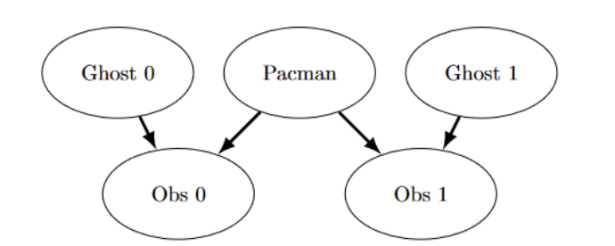

## Project4:Ghostbusters

### Q1:Bayes Net Structure
按照图片中给出的贝叶斯网络进行构造

```python
def constructBayesNet(gameState: hunters.GameState):
    """
    Construct an empty Bayes net according to the structure given in Figure 1
    of the project description.

    You *must* name all variables using the constants in this function.

    In this method, you should:
    - populate `variables` with the Bayes Net nodes
    - populate `edges` with every edge in the Bayes Net. we will represent each
      edge as a tuple `(from, to)`.
    - set each `variableDomainsDict[var] = values`, where `values` is a list
      of the possible assignments to `var`.
        - each agent position is a tuple (x, y) where x and y are 0-indexed
        - each observed distance is a noisy Manhattan distance:
          it's non-negative and |obs - true| <= MAX_NOISE
    - this uses slightly simplified mechanics vs the ones used later for simplicity
    """
    # constants to use
    PAC = "Pacman"
    GHOST0 = "Ghost0"
    GHOST1 = "Ghost1"
    OBS0 = "Observation0"
    OBS1 = "Observation1"
    X_RANGE = gameState.getWalls().width
    Y_RANGE = gameState.getWalls().height
    MAX_NOISE = 7

    variables = []
    edges = []
    variableDomainsDict = {}

    "*** YOUR CODE HERE ***"
    variables = [PAC,GHOST0,GHOST1,OBS0,OBS1] 
    edges = [(GHOST0,OBS0),(PAC,OBS0),(PAC,OBS1),(GHOST1,OBS1)] 
    variableDomainsDict[PAC] = [(x,y) for x in range(X_RANGE) for y in range(Y_RANGE)]
    variableDomainsDict[GHOST0] = [(x,y) for x in range(X_RANGE) for y in range(Y_RANGE)]
    variableDomainsDict[GHOST1] = [(x,y) for x in range(X_RANGE) for y in range(Y_RANGE)]
    #PAC,GHOST0,GHOST1可能取到的位置是"anywhere in the grid (we ignore walls for this)",位置用元组表示

    variableDomainsDict[OBS0] = [i for i in range(X_RANGE + Y_RANGE - 1 + MAX_NOISE)]
    variableDomainsDict[OBS1] = [i for i in range(X_RANGE + Y_RANGE - 1 + MAX_NOISE)]
    #Observations的值是曼哈顿距离加减noise,且Observations的值非负,因此Observations的取值范围如上
    "*** END YOUR CODE HERE ***"

    net = bn.constructEmptyBayesNet(variables, edges, variableDomainsDict)
    return net
```

### Q2:Join Factors
这里的python语法不大懂，网上找的答案
```python
def joinFactors(factors: List[Factor]):
    """
    Input factors is a list of factors.  
    
    You should calculate the set of unconditioned variables and conditioned 
    variables for the join of those factors.

    Return a new factor that has those variables and whose probability entries 
    are product of the corresponding rows of the input factors.

    You may assume that the variableDomainsDict for all the input 
    factors are the same, since they come from the same BayesNet.

    joinFactors will only allow unconditionedVariables to appear in 
    one input factor (so their join is well defined).

    Hint: Factor methods that take an assignmentDict as input 
    (such as getProbability and setProbability) can handle 
    assignmentDicts that assign more variables than are in that factor.

    Useful functions:
    Factor.getAllPossibleAssignmentDicts
    Factor.getProbability
    Factor.setProbability
    Factor.unconditionedVariables
    Factor.conditionedVariables
    Factor.variableDomainsDict
    """

    # typecheck portion
    setsOfUnconditioned = [set(factor.unconditionedVariables()) for factor in factors]
    if len(factors) > 1:
        intersect = functools.reduce(lambda x, y: x & y, setsOfUnconditioned)
        if len(intersect) > 0:
            print("Factor failed joinFactors typecheck: ", factor)
            raise ValueError("unconditionedVariables can only appear in one factor. \n"
                    + "unconditionedVariables: " + str(intersect) + 
                    "\nappear in more than one input factor.\n" + 
                    "Input factors: \n" +
                    "\n".join(map(str, factors)))


    "*** YOUR CODE HERE ***"
    inputUnconditionedVariable = functools.reduce(lambda x, y: x| y, \
                                                  [factor.unconditionedVariables() for factor in factors])
    inputconditionedVariable = functools.reduce(lambda x, y: x | y, \
                                                [factor.conditionedVariables() for factor in factors])
    inputVariableDomain = functools.reduce(lambda x, y: x | y, \
                                           [factor.variableDomainsDict() for factor in factors])
    inputconditionedVariable -= inputUnconditionedVariable 
    new_factor = Factor(inputUnconditionedVariable, \
                        inputconditionedVariable, inputVariableDomain)
    assignments = new_factor.getAllPossibleAssignmentDicts()
    for assignment in assignments:
        p = 1
        for factor in factors:
            p *= factor.getProbability(assignment)
        new_factor.setProbability(assignment, p)
        
    return new_factor
    "*** END YOUR CODE HERE ***"
```
以下是Copilot对这段代码的解释：
这段代码的每一步作用如下：

```python
inputUnconditionedVariable = functools.reduce(lambda x, y: x | y, 
                                              [factor.unconditionedVariables() for factor in factors])
```
- 作用：把所有因子的无条件变量（unconditionedVariables）合并成一个大集合（并集）。
- 语法：  
  - `[factor.unconditionedVariables() for factor in factors]` 得到所有因子的无条件变量集合的列表。
  - `lambda x, y: x | y` 是集合的并集操作。
  - `functools.reduce(...)` 会把列表里的集合依次做并集，得到所有无条件变量的总集合。

---

```python
inputconditionedVariable = functools.reduce(lambda x, y: x | y, 
                                            [factor.conditionedVariables() for factor in factors])
```
- 作用：把所有因子的条件变量（conditionedVariables）合并成一个大集合（并集）。
- 语法同上，只不过是处理条件变量。

---

```python
inputVariableDomain = functools.reduce(lambda x, y: x | y, 
                                       [factor.variableDomainsDict() for factor in factors])
```
- 作用：合并所有因子的变量取值域（domain），得到所有变量的取值范围。
- 注意：如果 variableDomainsDict 是字典，这里应该用 update 或 dict 合并，直接用 `|` 只有在 Python 3.9+ 字典才支持并集操作。

---

```python
inputconditionedVariable -= inputUnconditionedVariable 
```
- 作用：从条件变量集合中去掉所有无条件变量，避免重复。因为一个变量不能同时是无条件和条件变量。

---

```python
new_factor = Factor(inputUnconditionedVariable, 
                    inputconditionedVariable, inputVariableDomain)
```
- 作用：用上面合并得到的无条件变量、条件变量和变量取值域，创建一个新的 Factor 对象。

---

```python
assignments = new_factor.getAllPossibleAssignmentDicts()
```
- 作用：获取新因子所有变量的所有可能赋值组合（即所有可能的 assignment 字典）。

---

```python
for assignment in assignments:
    p = 1
    for factor in factors:
        p *= factor.getProbability(assignment)
    new_factor.setProbability(assignment, p)
```
- 作用：  
  - 遍历每一个可能的 assignment。
  - 对每个 assignment，依次取出所有原因子在该 assignment 下的概率，并相乘（乘法规则）。
  - 把乘积结果作为新因子在该 assignment 下的概率，写入新因子。

---

```python
return new_factor
```
- 作用：返回合并后的新因子。

---

**总结**
这段代码的整体作用是：  
**将多个因子合并成一个新因子，新因子的概率表是所有输入因子概率表的乘积。**  
这是贝叶斯网络推理中“因子相乘”的标准

### Q3:Eliminate (not ghosts yet)
```python
def eliminateWithCallTracking(callTrackingList=None):

    def eliminate(factor: Factor, eliminationVariable: str):
        """
        Input factor is a single factor.
        Input eliminationVariable is the variable to eliminate from factor.
        eliminationVariable must be an unconditioned variable in factor.
        
        You should calculate the set of unconditioned variables and conditioned 
        variables for the factor obtained by eliminating the variable
        eliminationVariable.

        Return a new factor where all of the rows mentioning
        eliminationVariable are summed with rows that match
        assignments on the other variables.

        Useful functions:
        Factor.getAllPossibleAssignmentDicts
        Factor.getProbability
        Factor.setProbability
        Factor.unconditionedVariables
        Factor.conditionedVariables
        Factor.variableDomainsDict
        """
        # autograder tracking -- don't remove
        if not (callTrackingList is None):
            callTrackingList.append(('eliminate', eliminationVariable))

        # typecheck portion
        if eliminationVariable not in factor.unconditionedVariables():
            print("Factor failed eliminate typecheck: ", factor)
            raise ValueError("Elimination variable is not an unconditioned variable " \
                            + "in this factor\n" + 
                            "eliminationVariable: " + str(eliminationVariable) + \
                            "\nunconditionedVariables:" + str(factor.unconditionedVariables()))
        
        if len(factor.unconditionedVariables()) == 1:
            print("Factor failed eliminate typecheck: ", factor)
            raise ValueError("Factor has only one unconditioned variable, so you " \
                    + "can't eliminate \nthat variable.\n" + \
                    "eliminationVariable:" + str(eliminationVariable) + "\n" +\
                    "unconditionedVariables: " + str(factor.unconditionedVariables()))

        "*** YOUR CODE HERE ***"
        inputUnconditionedVariable = factor.unconditionedVariables() - {eliminationVariable}
        inputconditionedVariable = factor.conditionedVariables()
        inputVariableDomain = factor.variableDomainsDict()

        new_factor = Factor(inputUnconditionedVariable, inputconditionedVariable, inputVariableDomain)

        assignments = factor.getAllPossibleAssignmentDicts()
        for assignment in assignments:
            p = factor.getProbability(assignment)
            new_factor.setProbability(assignment, new_factor.getProbability(assignment) + p)
        return new_factor
        "*** END YOUR CODE HERE ***"

    return eliminate
```

`eliminate` 函数的功能是：**在概率因子（Factor）中消去（边缘化）一个无条件变量**，得到一个新的因子，其概率表为原因子在被消去变量所有取值下概率的和。

---

**详细说明**

- **输入**  
  - `factor`：一个概率因子（Factor），包含若干无条件变量和条件变量。
  - `eliminationVariable`：要消去的无条件变量（必须是 factor 的 unconditioned variable）。

- **输出**  
  - 返回一个新的因子，其无条件变量集合为原因子的无条件变量去掉 eliminationVariable，其概率表为原因子在 eliminationVariable 所有取值下概率的和。

- **主要步骤**  
  1. 检查 eliminationVariable 是否是无条件变量，且不能是唯一的无条件变量。
  2. 构造新因子（去掉 eliminationVariable 的无条件变量，其余变量和变量域不变）。
  3. 遍历新因子的所有赋值（不包含 eliminationVariable），对 eliminationVariable 的所有可能取值，累加原因子在这些赋值下的概率。
  4. 将累加结果写入新因子的概率表。

- **用途**  
  - 在贝叶斯网络推理（如变量消除算法）中，用于“边缘化”掉某个变量，即对该变量求和，得到只与其他变量有关的概率分布。

---

**简化理解：**  
eliminate 就是把因子里的某个变量“求和消去”，得到一个不包含该变量的新因子。

### Q4:Variable Elimination
```python
def inferenceByVariableEliminationWithCallTracking(callTrackingList=None):

    def inferenceByVariableElimination(bayesNet: bn, queryVariables: List[str], evidenceDict: Dict, eliminationOrder: List[str]):
        """
        This function should perform a probabilistic inference query that
        returns the factor:

        P(queryVariables | evidenceDict)

        It should perform inference by interleaving joining on a variable
        and eliminating that variable, in the order of variables according
        to eliminationOrder.  See inferenceByEnumeration for an example on
        how to use these functions.

        You need to use joinFactorsByVariable to join all of the factors 
        that contain a variable in order for the autograder to 
        recognize that you performed the correct interleaving of 
        joins and eliminates.

        If a factor that you are about to eliminate a variable from has 
        only one unconditioned variable, you should not eliminate it 
        and instead just discard the factor.  This is since the 
        result of the eliminate would be 1 (you marginalize 
        all of the unconditioned variables), but it is not a 
        valid factor.  So this simplifies using the result of eliminate.

        The sum of the probabilities should sum to one (so that it is a true 
        conditional probability, conditioned on the evidence).

        bayesNet:         The Bayes Net on which we are making a query.
        queryVariables:   A list of the variables which are unconditioned
                          in the inference query.
        evidenceDict:     An assignment dict {variable : value} for the
                          variables which are presented as evidence
                          (conditioned) in the inference query. 
        eliminationOrder: The order to eliminate the variables in.

        Hint: BayesNet.getAllCPTsWithEvidence will return all the Conditional 
        Probability Tables even if an empty dict (or None) is passed in for 
        evidenceDict. In this case it will not specialize any variable domains 
        in the CPTs.

        Useful functions:
        BayesNet.getAllCPTsWithEvidence
        normalize
        eliminate
        joinFactorsByVariable
        joinFactors
        """

        # this is for autograding -- don't modify
        joinFactorsByVariable = joinFactorsByVariableWithCallTracking(callTrackingList)
        eliminate             = eliminateWithCallTracking(callTrackingList)
        if eliminationOrder is None: # set an arbitrary elimination order if None given
            eliminationVariables = bayesNet.variablesSet() - set(queryVariables) -\
                                   set(evidenceDict.keys())
            eliminationOrder = sorted(list(eliminationVariables))

        "*** YOUR CODE HERE ***"
        currentFactorsList = bayesNet.getAllCPTsWithEvidence(evidenceDict)
        for e in eliminationOrder:
            currentFactorsList, new_factor = joinFactorsByVariable(currentFactorsList, e)
            if len(new_factor.unconditionedVariables()) > 1:
                new_factor = eliminate(new_factor, e)
                currentFactorsList.append(new_factor)
        factor = normalize(joinFactors(currentFactorsList))
        return factor
        "*** END YOUR CODE HERE ***"


    return inferenceByVariableElimination
```
`inferenceByVariableElimination` 函数的功能是：  
**在给定贝叶斯网络、查询变量、观测证据和消元顺序的情况下，使用变量消除（Variable Elimination）算法进行概率推理，计算条件概率分布 $P(\text{queryVariables} \mid \text{evidenceDict})$。**

---

**主要流程**

1. **获取所有CPT因子（带观测证据）**  
   - 使用 `bayesNet.getAllCPTsWithEvidence(evidenceDict)` 得到所有与观测证据一致的因子列表。

2. **按消元顺序依次处理每个变量**  
   - 对于每个消元变量 $e$：
     - 用 `joinFactorsByVariable` 将所有包含 $e$ 的因子合并成一个新因子。
     - 如果新因子的无条件变量数大于1，则用 `eliminate` 消去 $e$，否则丢弃该因子（避免无效因子）。
     - 将消元后的新因子加入因子列表。

3. **合并所有剩余因子**  
   - 用 `joinFactors` 将所有剩余因子合并成一个总因子。

4. **归一化**  
   - 用 `normalize` 对最终因子进行归一化，使概率和为1，得到条件概率分布。

5. **返回结果**  
   - 返回归一化后的因子，即 $P(\text{queryVariables} \mid \text{evidenceDict})$。

### Q5a:DiscreteDistribution Class
没啥值得说的，按要求完成就行
```python
    def normalize(self):
        """
        Normalize the distribution such that the total value of all keys sums
        to 1. The ratio of values for all keys will remain the same. In the case
        where the total value of the distribution is 0, do nothing.

        >>> dist = DiscreteDistribution()
        >>> dist['a'] = 1
        >>> dist['b'] = 2
        >>> dist['c'] = 2
        >>> dist['d'] = 0
        >>> dist.normalize()
        >>> list(sorted(dist.items()))
        [('a', 0.2), ('b', 0.4), ('c', 0.4), ('d', 0.0)]
        >>> dist['e'] = 4
        >>> list(sorted(dist.items()))
        [('a', 0.2), ('b', 0.4), ('c', 0.4), ('d', 0.0), ('e', 4)]
        >>> empty = DiscreteDistribution()
        >>> empty.normalize()
        >>> empty
        {}
        """
        "*** YOUR CODE HERE ***"
        sum = self.total()
        if sum == 0 :
            return
        for k,v in self.items():
            self[k] = v / sum 
        "*** END YOUR CODE HERE ***"

    def sample(self):
        """
        Draw a random sample from the distribution and return the key, weighted
        by the values associated with each key.

        >>> dist = DiscreteDistribution()
        >>> dist['a'] = 1
        >>> dist['b'] = 2
        >>> dist['c'] = 2
        >>> dist['d'] = 0
        >>> N = 100000.0
        >>> samples = [dist.sample() for _ in range(int(N))]
        >>> round(samples.count('a') * 1.0/N, 1)  # proportion of 'a'
        0.2
        >>> round(samples.count('b') * 1.0/N, 1)
        0.4
        >>> round(samples.count('c') * 1.0/N, 1)
        0.4
        >>> round(samples.count('d') * 1.0/N, 1)
        0.0
        """
        "*** YOUR CODE HERE ***"
        self.normalize()
        x = random.random()
        prob = 0
        for k, v in self.items():
            prob += v
            if x <= prob:
                return k
        "*** END YOUR CODE HERE ***"
```

### Q5b:Observation Probability
```python
    def getObservationProb(self, noisyDistance: int, pacmanPosition: Tuple, ghostPosition: Tuple, jailPosition: Tuple):
        """
        Return the probability P(noisyDistance | pacmanPosition, ghostPosition).
        """
        "*** YOUR CODE HERE ***"
        if noisyDistance is None or ghostPosition == jailPosition:
            return int(noisyDistance is None and ghostPosition == jailPosition)
        prob =  busters.getObservationProbability(noisyDistance, manhattanDistance(pacmanPosition, ghostPosition))
        return prob
        "*** END YOUR CODE HERE ***"
```
注意处理ghost’s position is the jail position的特殊情况

### Q6:Exact Inference Observation
```python
    def observeUpdate(self, observation: int, gameState: busters.GameState):
        """
        Update beliefs based on the distance observation and Pacman's position.

        The observation is the noisy Manhattan distance to the ghost you are
        tracking.

        self.allPositions is a list of the possible ghost positions, including
        the jail position. You should only consider positions that are in
        self.allPositions.

        The update model is not entirely stationary: it may depend on Pacman's
        current position. However, this is not a problem, as Pacman's current
        position is known.
        """
        "*** YOUR CODE HERE ***"
        pacmanPos = gameState.getPacmanPosition()
        jailPos = self.getJailPosition()
        for ghostPos,p in self.beliefs.items():
            prob = self.getObservationProb(observation, pacmanPos, ghostPos, jailPos)
            self.beliefs[ghostPos] = p * prob
        "*** END YOUR CODE HERE ***"
        self.beliefs.normalize()
```

### Q7:Exact Inference with Time Elapse
```python
    def elapseTime(self, gameState: busters.GameState):
        """
        Predict beliefs in response to a time step passing from the current
        state.

        The transition model is not entirely stationary: it may depend on
        Pacman's current position. However, this is not a problem, as Pacman's
        current position is known.
        """
        "*** YOUR CODE HERE ***"
        newbelief = DiscreteDistribution()
        for oldPos in self.allPositions:
            newPosDist = self.getPositionDistribution(gameState, oldPos)
            for newPos, p in newPosDist.items():
                newbelief[newPos] += self.beliefs[oldPos] * p
        self.beliefs = newbelief
        self.beliefs.normalize()
        "*** END YOUR CODE HERE ***"
```

### Q8:Exact Inference Full Test

```python
    def chooseAction(self, gameState: busters.GameState):
        """
        First computes the most likely position of each ghost that has
        not yet been captured, then chooses an action that brings
        Pacman closest to the closest ghost (according to mazeDistance!).
        """
        pacmanPosition = gameState.getPacmanPosition()
        legal = [a for a in gameState.getLegalPacmanActions()]
        livingGhosts = gameState.getLivingGhosts()
        livingGhostPositionDistributions = \
            [beliefs for i, beliefs in enumerate(self.ghostBeliefs)
             if livingGhosts[i+1]]
        "*** YOUR CODE HERE ***"
        minDistance = float('inf')
        for ghostPositionDistribution in livingGhostPositionDistributions:
            ghostPos = ghostPositionDistribution.argMax()
            distance = self.distancer.getDistance(pacmanPosition, ghostPos)
            if distance < minDistance:
                minDistance = distance
                bestAction = Directions.STOP
                for action in legal:
                    successorPosition = Actions.getSuccessor(pacmanPosition, action)
                    newDistance = self.distancer.getDistance(successorPosition, ghostPos)
                    if newDistance < minDistance:
                        minDistance = newDistance
                        bestAction = action
        return bestAction
        "*** END YOUR CODE HERE ***"
```
Copilot总结：
`chooseAction` 函数在 `GreedyBustersAgent` 类中用于选择 Pacman 的下一个动作，其工作流程如下：

1. **获取 Pacman 当前位置和可行动作**  
   - 通过 `gameState.getPacmanPosition()` 获取当前 Pacman 的坐标。
   - 通过 `gameState.getLegalPacmanActions()` 获取所有合法动作。

2. **筛选未被捕获的幽灵及其位置分布**  
   - `gameState.getLivingGhosts()` 返回哪些幽灵还活着。
   - `self.ghostBeliefs` 存储了每个幽灵的概率分布（belief distribution）。
   - 只保留还活着的幽灵的概率分布。

3. **为每个活着的幽灵，找到其最可能的位置**  
   - 对每个幽灵的概率分布，使用 `argMax()` 找到概率最大的格子（即最可能的位置）。

4. **计算 Pacman 到每个幽灵最可能位置的迷宫距离**  
   - 用 `self.distancer.getDistance(pacmanPosition, ghostPos)` 计算距离。
   - 找到距离最近的幽灵，并记录其位置。

5. **在所有合法动作中，选择能让 Pacman 更靠近最近幽灵的位置的动作**  
   - 对每个动作，计算执行该动作后 Pacman 到最近幽灵的距离。
   - 选择距离最小的动作作为最佳动作。

6. **返回最佳动作**  
   - Pacman 会朝着最近的幽灵最可能出现的位置前进。

---

**总结：**  
该函数的策略是：每一步都估计每个幽灵最可能的位置，然后选择一个动作，使 Pacman 尽快靠近最近的幽灵。这是一种贪心策略

### Q9:Approximate Inference Initialization and Beliefs
```python
    def initializeUniformly(self, gameState: busters.GameState):
        """
        Initialize a list of particles. Use self.numParticles for the number of
        particles. Use self.legalPositions for the legal board positions where
        a particle could be located. Particles should be evenly (not randomly)
        distributed across positions in order to ensure a uniform prior. Use
        self.particles for the list of particles.
        """
        self.particles = []
        "*** YOUR CODE HERE ***"
        quotient = self.numParticles // len(self.legalPositions)
        for pos in self.legalPositions:
            self.particles += [pos] * quotient
        remainder = self.numParticles % len(self.legalPositions)
        if remainder > 0:
            self.particles += self.legalPositions[:remainder]
        "*** END YOUR CODE HERE ***"

    def getBeliefDistribution(self):
        """
        Return the agent's current belief state, a distribution over ghost
        locations conditioned on all evidence and time passage. This method
        essentially converts a list of particles into a belief distribution.

        This function should return a normalized distribution.
        """
        "*** YOUR CODE HERE ***"
        belief = DiscreteDistribution()
        for pos in self.particles:
            if pos in belief:
                belief[pos]+=1
            else:
                belief[pos]=1
        belief.normalize()
        return belief
        "*** END YOUR CODE HERE ***"
```
initializeUniformly函数均匀分配particles,getBeliefDistribution函数将particles列表转换为信念分布BeliefDistribution

### Q10:Approximate Inference Observation
```python
    def observeUpdate(self, observation: int, gameState: busters.GameState):
        """
        Update beliefs based on the distance observation and Pacman's position.

        The observation is the noisy Manhattan distance to the ghost you are
        tracking.

        There is one special case that a correct implementation must handle.
        When all particles receive zero weight, the list of particles should
        be reinitialized by calling initializeUniformly. The total method of
        the DiscreteDistribution may be useful.
        """
        "*** YOUR CODE HERE ***"
        pacmanPos = gameState.getPacmanPosition()
        jailPos = self.getJailPosition()
        beliefDis = self.getBeliefDistribution()
        for ghostPos,prob in beliefDis.items():
            p = self.getObservationProb(observation,pacmanPos,ghostPos,jailPos)
            beliefDis[ghostPos] = p * prob
        if beliefDis.total() == 0:
            self.initializeUniformly(gameState)
            return
        beliefDis.normalize()
        self.particles = [beliefDis.sample() for i in range(self.numParticles)]
        "*** END YOUR CODE HERE ***"
```
`observeUpdate` 函数用于根据观测到的距离信息和当前游戏状态，更新对幽灵位置的信念分布。其工作流程如下：

1. **获取必要信息**  
   - 通过 `gameState.getPacmanPosition()` 获取当前 Pacman 的位置。
   - 通过 `self.getJailPosition()` 获取幽灵被抓住时的位置。

2. **遍历所有可能的幽灵位置**  
   - 对于每个可能的幽灵位置 `ghostPos`，取出当前的信念概率 `prob`。

3. **计算观测概率并更新信念**  
   - 调用 `self.getObservationProb(observation, pacmanPos, ghostPos, jailPos)` 计算在该位置下观测到当前距离的概率 `p`。
   - 用贝叶斯法则更新信念：`self.beliefs[ghostPos] = p * prob`。(也就是：**新信念 = 旧信念 × 观测概率**)

4. **归一化信念分布**  
   - 所有位置的信念更新后，调用 `self.beliefs.normalize()` 使概率和为1。

### Q11:Approximate Inference with Time Elapse
```python
    def elapseTime(self, gameState):
        """
        Sample each particle's next state based on its current state and the
        gameState.
        """
        "*** YOUR CODE HERE ***"
        belief = self.getBeliefDistribution()
        newbelief = DiscreteDistribution()
        for oldPos, prob in belief.items():
            newPosDist = self.getPositionDistribution(gameState, oldPos)
            for newPos, p in newPosDist.items():
                newbelief[newPos] += prob * p
        if newbelief.total() == 0:
            self.initializeUniformly(gameState)
            return
        newbelief.normalize()
        self.particles = [newbelief.sample() for i in range(self.numParticles)]
        "*** END YOUR CODE HERE ***"
```

